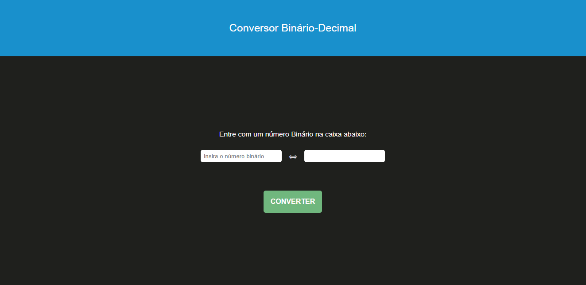

# 💻 Bin2Dec

## 🎯 Proposta

O objetivo da aplicação é servir como um conversor de número binário para decimal.

> O site conta com sistema de validação para números binários inteiros, feito por meio de JavaScript.

## 🚀 Funcionalidades

- [ x ] Conversão de um número binário de tamanho arbitrário
- [ x ] Notificação quando o número inserido não representa um binário inteiro válido
- [ x ] Visualização do número binário em seu decimal correspondente

## ☕ Usando O Jogo da Forca

Para usar o Bin2Dec basta acessar o seguinte site: [Bin2Dec](www.google.com.br)

[⬆ Voltar ao topo](#-bin2dec)
