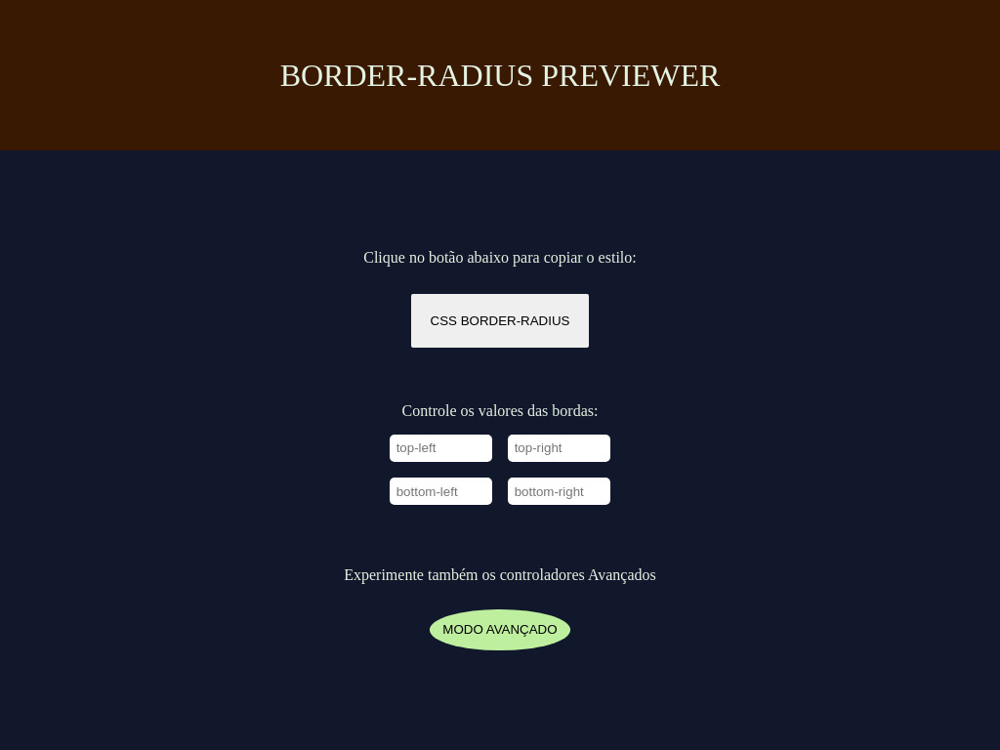

# 📐 Border Radius Previewer

## 🎯 Proposta

O objetivo da aplicação é proporcionar a visualização das mudanças aplicadas pelo estilo border-radius em um botão.

> O site conta com sistema de validação para números binários inteiros, feito por meio de JavaScript.

## 🚀 Funcionalidades

- [x] Alterar os 4 principais valores de `border-radius` (top-left, top-right, bottom-left, bottom-right)
- [x] Alterar os 8 valores do `border-radius`
- [x] Copiar o estilo do `border-radius` aplicado no botão ao clica-lo

## ☕ Usando O APP

Para usar o Border-radius Previewer basta acessar o seguinte site: [Border Radius Previewer](https://lucashenrique-dev.github.io/app-ideas/projects/Border-radius_Previewer/index.html)

[⬆ Voltar ao topo](#-border-radius-previewer)
