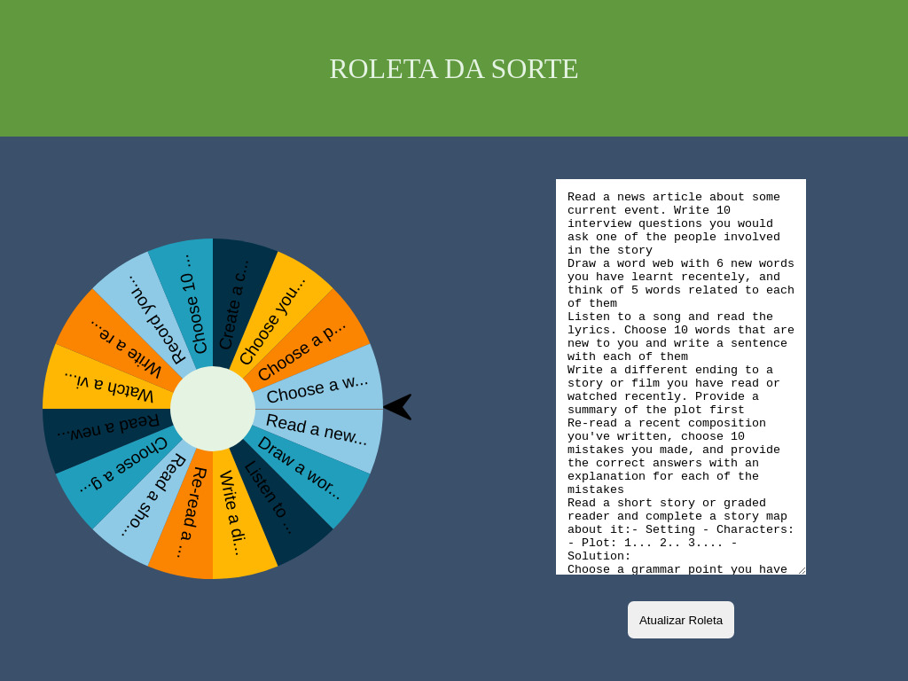

# 🎡🍀 Roda da Sorte

## 🎯 Proposta

O objetivo da aplicação é criar um jogo de "Roda/Roleta da sorte" em que o usuário pode elencar opções na área de texto e depois clicar na roda para, assim, efetuar o sorteio.

> Sistema é capaz travar novas jogadas enquanto houver um sorteio em curso.

## 🚀 Funcionalidades

- [x] Aceita uma quantidade razoável de opções para a roleta (número de opções muito elevadas dificultam a visualização das mesmas dentro da roleta)
- [x] Botão para atualização da roleta
- [x] Texto das opções não transbordam a roleta (são abreviado com "...")
- [x] Sistema aguarda uma jogada terminar para poder começar uma nova
- [x] Distrubuição alternada de cores para cada opção
- [x] Visualização da opção sorteada (seta e notificação do site)

## ☕ Usando O APP

Para usar a Roda Da Sorte basta acessar o seguinte site: [Roda Da Sorte](https://lucashenrique-dev.github.io/app-ideas/projects/Dificuldades/Intermediario/RodaDaSorte/index.html)

[⬆ Voltar ao topo](#-roda-da-sorte)
